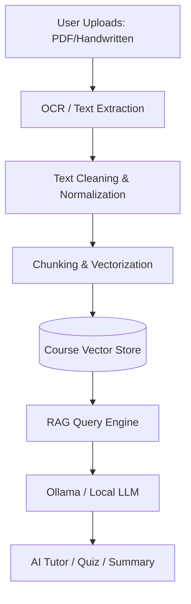

# LearnBridge AI 

### *Transforming Static Learning into Dynamic Intelligence*

[](https://www.djangoproject.com/)
[](https://www.python.org/)
[](https://ollama.com/)
[](https://en.wikipedia.org/wiki/Retrieval-augmented_generation)
[](LICENSE)

---

## 📌 Table of Contents
- [Project Overview](#-project-overview)
- [Problem Statement](#-problem-statement)
- [The Solution](#-the-solution)
- [Core Features](#-core-features)
- [Faculty Intelligence Dashboard](#-faculty-intelligence-dashboard)
- [Smart Analytics & Insights](#-smart-analytics--insights)
- [System Architecture](#-system-architecture)
- [RAG Workflow](#-rag-workflow)
- [Tech Stack](#-tech-stack)
- [Installation & Setup](#-installation--setup)
- [Folder Structure](#-folder-structure)
- [Challenges Solved](#-challenges-solved)
- [Future Scope](#-future-scope)
- [Developer Section](#-developer-section)

---

## Project Overview
**LearnBridge AI** is a next-generation, AI-powered learning platform designed for the modern educational ecosystem. It redefines the traditional LMS by treating every course as a **Smart AI Workspace**. 

Instead of just storing files, LearnBridge AI digests uploaded material—PDFs, PPTs, handwritten notes, and even screenshots—to provide a localized, context-aware AI ecosystem for both students and educators.

###  The Workflow
1. **Create Course** ➔ 2. **Upload Notes** ➔ 3. **AI Orchestration** (Automatic)

---

##  Problem Statement
In traditional learning environments:
- **Data Overload:** Students struggle to navigate massive PDFs and lecture slides.
- **Surface-Level Analytics:** Faculty see "grades" but don't understand *why* students are failing.
- **Generic AI:** Public AI tools lack the context of the specific course material being taught in class.
- **Static Content:** Handwritten notes and images are often excluded from digital search and analysis.

---

## The Solution
LearnBridge AI bridges this gap by:
- **Contextual Intelligence:** AI tools work exclusively on the uploaded course syllabus.
- **Deep Insight Analytics:** Moving beyond numbers to actionable faculty recommendations.
- **Universal Extraction:** OCR-powered engine that reads everything from typed DOCX to handwritten ink.
- **Local Persistence:** Powered by local LLMs via Ollama for privacy and offline capability.

---

##  Core Features

### 1. AI Tutor
- **Context-Locked:** Answers are generated strictly from selected course notes.
- **Deep Linking:** Points students to the specific source document for every answer.

### 2. Quiz Generator
- **Multi-Format:** Generates MCQs, True/False, and Conceptual questions on the fly.
- **Dynamic Difficulty:** Ensures no two quizzes are ever exactly the same.
- **Faculty Control:** Teachers can generate standardized tests from their own materials.

### 3.  Flashcard Generator
- **Auto-Extraction:** Identifies key terms, definitions, and formulas automatically.
- **Smart Revision:** Designed for high-frequency spaced repetition learning.

### 4.  Smart Summary
- **Condensation Engine:** Summarizes 50-page PDFs into readable, high-impact bullet points.
- **Exportable:** Generate formatted PDF summaries for offline reading.

### 5.  Multilingual & OCR Support
- **Multi-Script OCR:** Recognizes and processes English, Hindi, and Marathi text.
- **Handwritten Integration:** Converts student notebook photos into searchable AI context.

---

##  Faculty Intelligence Dashboard
*Turn monitoring into mentorship.*

###  Real-Time Overview
- **Engagement Tracking:** Live count of active users and platform interaction frequency.
- **Performance Averaging:** Instant heat-map of class-wide quiz performance.

###  Detailed Student Profiles
Clicking a student reveals a **360° Insight Profile**:
- **Improvement Trends:** Are they getting better or sliding back?
- **Screen Time Analysis:** Precise breakdown of time spent on AI Tutor vs. Quizzes.
- **Weak Topic Map:** Data-driven list of concepts where the student consistently fails in quizzes.
- **Activity Status:** Clear "On Track", "Moderate", or "Needs Attention" badges.

###  Class Insights
- **Common Weak Areas:** Identifies which topics the *entire class* is struggling with.
- **Attention List:** Auto-flags students who haven't logged in for 10+ days.
- **Top Performers:** Celebrates students with consistent highs and high engagement.

---

##  Smart Analytics
LearnBridge AI doesn't just show data; it provides **Actionable Intelligence**:

- **Consistency Score:** Calculated based on login streaks and tool usage frequency.
- **Recommendation Engine:** 
  - *Class avg < 50%?* → Suggests a practice quiz.
  - *Regression identified as a weak topic?* → Suggests a revision session.
  - *Strong performer detected?* → Suggests an advanced challenge quiz.

---

##  System Architecture


---

##  RAG Workflow
1. **Extraction:** PyMuPDF, OCR (EasyOCR/Tesseract) for text capture.
2. **Chunking:** Semantic splitting of text into manageable segments.
3. **Embeddings:** Text converted into high-dimensional vectors.
4. **Context Retrieval:** Similarity search identifies relevant chunks for a user query.
5. **Generation:** Local LLM synthesizes the final response using the retrieved context.

---

##  Tech Stack

| Layer | Technologies |
|---|---|
| **Frontend** | HTML5, CSS3 (Vanilla + Bootstrap), JS (ES6+) |
| **Backend** | Python 3.x, Django 4.x |
| **AI / ML** | Ollama, Llama 3, LLaVA (Vision), RAG Pipeline |
| **Extraction** | Tesseract OCR, EasyOCR, PyMuPDF |
| **Database** | SQLite (Default) / PostgreSQL Compatible |

---

##  Installation & Setup

### 1. Clone the Project
```bash
git clone https://github.com/dishasonawane04/LearnBridge-AI.git
cd LearnBridgeAI
```

### 2. Virtual Environment
```bash
python -m venv venv
source venv/bin/activate  # On Windows: venv\Scripts\activate
```

### 3. Install Dependencies
```bash
pip install -r requirements.txt
```

### 4. Database Setup
```bash
python manage.py makemigrations
python manage.py migrate
```

---

##  How to Run

###  Step 1: External AI Nodes (Ollama)
Ensure Ollama is installed and the models are pulled:
```bash
ollama serve
ollama pull llama3
ollama pull llava
```

###  Step 2: Start Django Server
```bash
python manage.py runserver
```
Visit `http://127.0.0.1:8000` in your browser.

---

## Folder Structure
```text
LearnBridgeAI/
├── core/                # Base layout, navbar, home views
├── analytics/           # Faculty dashboard, insight engine, logs
├── ai_engine/           # RAG logic, Ollama integration, vector store
├── generator/           # Quiz, Summary, Flashcard logic
├── media/               # Uploaded course materials & processing
├── templates/           # Global templates
└── requirements.txt     # Project dependencies
```

---

## Challenges Solved
- **Noisy OCR:** Implemented a multi-stage cleaning pipeline for handwritten notes.
- **Context Leakage:** Developed a strict course-locked RAG system to prevent AI from "hallucinating" outside the syllabus.
- **Performance:** optimized Django signals for background processing of large documents.
- **UX Complexity:** Transformed complex data points into simple, actionable cards for non-technical faculty.

---

## Future Scope
- **Real-Time Collaboration:** Shared AI study rooms for students.
- **Voice-to-Notes:** Direct transcription of live lectures into the course context.
- **API Integration:** Connect with Google Classroom and Moodle.
- **Mobile App:** Cross-platform mobile experience with Flutter.

---

## Why It Stands Out
LearnBridge AI isn't a wrapper around ChatGPT. It is a **full-stack vertical solution** that handles the entire pipeline—from the raw ink on a student's page to a high-level faculty intervention recommendation. It prioritizes **Privacy (Local AI)** and **Actionable Insights**.

---

##  Developers

### **Disha Sonawane**  
*Focused on bridging the gap between AI research and practical educational tools.*
GitHub: https://github.com/dishasonawane04

### **Rajeev Kumar**  
*Focused on building scalable technology solutions and impactful AI-driven systems.*
GitHub: https://github.com/rajeevkumar

###  Collaboration  
*LearnBridge AI was developed collaboratively with a shared vision of transforming education through intelligent, practical, and user-friendly AI tools.*

---

##  License
This project is licensed under the MIT License - see the [LICENSE](LICENSE) file for details.

---

## Conclusion
LearnBridge AI is more than an LMS—it's a digital mentor for students and a strategic advisor for faculty. By turning data into insights, it ensures that no student is left behind and every lesson is mastered.

---
Designed with ❤️ for the future of education.
